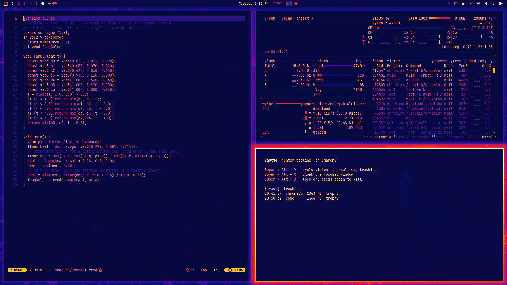

# Yautja mode for Omarchy

Hunter tooling for [Omarchy](https://omarchy.org): thermal vision shaders, a
window cloak, a lock-on kill key, and a trophy wall on the bar.

Pairs with the [Yautja theme](https://github.com/neilofneils404/omarchy-yautja-theme),
but works under any theme.

Fan-made and unaffiliated with any film or game franchise.



## What you get

| Key | Does |
| --- | --- |
| `Super + Alt + V` | Cycle vision mode: thermal, electromagnetic, tracking, off |
| `Super + Alt + C` | Cloak or decloak the focused window |
| `Super + Alt + X` | Lock on to the focused window. Press again within 6 seconds to kill it |

- **Vision modes** are full-screen Hyprland shaders. The mode you leave on
  survives config reloads and logins until you switch it off.
- **Cloak** drops a window to about 7% opacity.
- **Hunt** sends `SIGKILL` to the window's process. Unsaved work in it is lost.
  The honour code spares anything using under 100 MB as unarmed; pass
  `--no-honour` to `yautja hunt` to override it.
- **Trophy wall** is a bar widget: one skull per kill of 1 GB or more since
  boot. Left click cycles vision, middle click turns it off, right click lists
  the kills.
- **Yautja menu** adds all of the above to the Omarchy menu, plus Self-destruct:
  a 10 second countdown, then a real shutdown. Picking it again aborts.
- **Thermal look**: while the Yautja theme is active, the focused window gets a
  heat glow and the rest dim and cool. Themes installed from git cannot carry
  Hyprland Lua, so this lives here.

## Install

Requires Omarchy 4 (Lua Hyprland config and the Quickshell bar). Everything
else it uses already ships with Omarchy:

- `jq`, `pgrep` and `ps` for state and process lookups
- `hyprctl` for shaders, window tags and reloads
- `pw-play` (PipeWire) for the click sound; without it the plugin is silent

No sudo, no network access, no packages installed.

```bash
omarchy plugin add https://github.com/neilofneils404/omarchy-yautja.git --yes
~/.config/omarchy/plugins/neil.yautja/install.sh
```

`install.sh` links `yautja` into `~/.local/bin`, appends two lines to
`~/.config/hypr/hyprland.lua`, adds the menu block to
`~/.config/omarchy/extensions/omarchy-menu.jsonc`, and places the widget after
the workspaces. It backs up both files first and is safe to run again.

To work from your own checkout, clone it anywhere and run `./install.sh`; it
symlinks the checkout into the plugin directory.

## Command

```
yautja vision [next|off|thermal|em|tracking|status]
yautja cloak [all-off]
yautja hunt [--no-honour]
yautja trophies [notify|clear|json]
yautja self-destruct [abort]
```

- `SOUND=0` in `~/.config/yautja/config` silences the clicks.
- `YAUTJA_DRY_RUN=1 yautja self-destruct` runs the countdown without shutting down.

## Uninstall

```bash
~/.config/omarchy/plugins/neil.yautja/uninstall.sh
omarchy plugin remove neil.yautja
```

## Layout

```
manifest.json, BarWidget.qml   trophy wall bar widget
bin/yautja                     the command behind every key and menu row
shaders/                       thermal, em and tracking screen shaders
hypr/yautja.lua                keybinds, cloak and lock rules, thermal look
menu/omarchy-menu.jsonc        the Yautja submenu
sounds/clicks.ogg              synthesized click sound
```

## Licence

MIT
